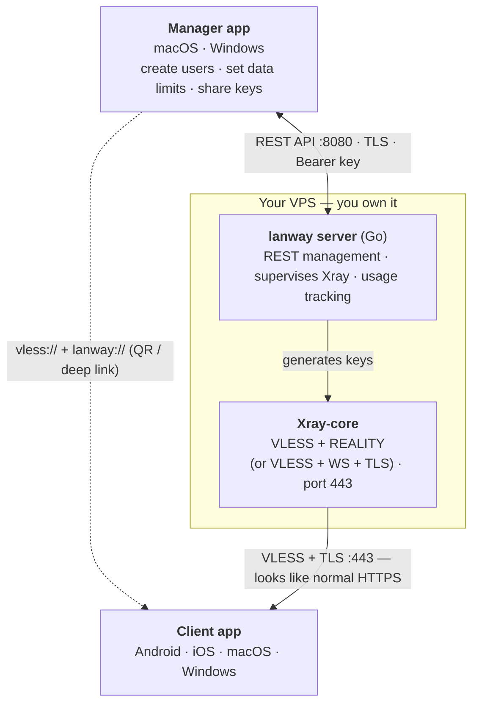

<div align="center">

# Lanway

**Browse free. Speak free. No limits.**

A free, open-source, anti-censorship VPN platform for people living under internet restrictions.

[Website](https://lanway.org) · [Download](https://lanway.org#download) · [Docs](https://lanway.org/docs) · [Releases](https://github.com/lanway-org/lanway/releases)

[](LICENSE)
&nbsp;[](https://github.com/lanway-org/lanway/actions)
&nbsp;[](#)
&nbsp;[](CONTRIBUTING.md)

`Free to use. Free to speak. Unlimited.`

</div>

---

## What is Lanway?

Lanway lets one person spin up a private VPN server and share access with friends and
family who need the open internet. There is **no Lanway company, no central server, and no
account**. Every server runs on the operator's own machine, and the apps talk directly to it.

The name comes from the Myanmar word _lan_ — "path" or "way": a way out.

### Why we built it

In Myanmar and many other places, governments throttle and block the tools people rely on to
read the news, organise, and speak freely. Ordinary VPN protocols are increasingly
fingerprinted and dropped by deep-packet inspection.

Lanway's traffic is designed to be **indistinguishable from normal HTTPS**. By default it uses
**VLESS + REALITY** on port 443 — the connection borrows the TLS handshake of a real, popular
website, so to a censor it looks like an everyday visit to that site. No domain is required, and
there is nothing obvious to block.

| | Outline (Shadowsocks) | **Lanway (VLESS + REALITY/TLS)** |
|---|---|---|
| Looks like normal HTTPS | Partially | **Yes** |
| Needs a domain | No | **No** (REALITY) — optional for TLS mode |
| Resists modern DPI | Weakening | **Strong** |
| Central service stores data | No | **No** |
| One-click cloud deploy | Yes | **Yes** (DigitalOcean) |

---

## Architecture

There is **no central server** — the Manager talks straight to a VPS you own, and the
clients connect to it directly. Lanway stores nothing.



Repository layout:

| Path | What |
|------|------|
| `server/` | Go + Docker management server that supervises Xray-core |
| `manager/` | Flutter desktop app (macOS + Windows) — run & manage a server |
| `client/` | Flutter app (Android + iOS + macOS + Windows) — connect & browse |
| `web/` | Landing page (HTML + Tailwind) |

---

## Quick start

### 1. Set up a server

**One click** — open the Manager app, choose **Create a server**, authorize DigitalOcean in
your browser, pick a region. The Manager provisions a droplet, installs Lanway, and connects
to it automatically.

**Or one command** — on any Ubuntu/Debian VPS you already have:

```bash
bash <(curl -fsSL https://get.lanway.org)
```

The installer prints a **Manager API URL** and an **access key**. Open the Manager app, choose
**Connect to a server**, and paste them in.

### 2. Create users and share keys

In the Manager dashboard, click **Add user**, give it a name and an optional data limit. Open
the user to get a **QR code** and a share link. Anyone can scan it with the Lanway app.

### 3. Connect

Install the Lanway client app, scan the QR (or tap the `lanway://` link), and press the big
button. The open internet is back.

---

## Building from source

| Component | Toolchain | Build |
|---|---|---|
| `server/` | Go 1.22+, Docker | `cd server && docker build -t lanway/server .` |
| `manager/` | Flutter 3.x | `cd manager && flutter run -d macos` |
| `client/` | Flutter 3.x | `cd client && flutter run` |
| `web/` | none | open `web/index.html` |

The server can also run locally without Docker if `xray` is on your `PATH`:

```bash
cd server
LANWAY_CONFIG_DIR=./data go run ./cmd/lanway
```

### Server API

All routes except `/api/health` require `Authorization: Bearer <access-key>`.

| Method | Path | Description |
|---|---|---|
| `GET` | `/api/health` | Liveness + stealth mode |
| `GET` | `/api/stats` | Users, bandwidth, uptime |
| `GET` | `/api/users` | List users |
| `POST` | `/api/users` | Create user `{ name, data_limit_gb }` |
| `DELETE` | `/api/users/:id` | Delete user |
| `GET` | `/api/users/:id/key` | Share links (`vless://` + `lanway://`) |

---

## Privacy

- **No central service.** Lanway runs nothing. Servers belong to the people who deploy them.
- **No logs of activity.** The server stores only the user list and cumulative byte counters,
  on the operator's own machine, to enforce data limits.
- **No accounts, no tracking.** The apps store connection details locally and encrypted.

---

## Contributing

Lanway is built by and for people who need the open internet. Issues, ideas, translations, and
pull requests are all welcome — see [CONTRIBUTING.md](CONTRIBUTING.md).

## License

Lanway is free forever, for everyone, under the [MIT License](LICENSE):

```text
MIT License

Copyright (c) 2026 Lanway Foundation

Permission is hereby granted, free of charge, to any person obtaining a copy
of this software and associated documentation files (the "Software"), to deal
in the Software without restriction, including without limitation the rights
to use, copy, modify, merge, publish, distribute, sublicense, and/or sell
copies of the Software, and to permit persons to whom the Software is
furnished to do so, subject to the following conditions:

The above copyright notice and this permission notice shall be included in all
copies or substantial portions of the Software.

THE SOFTWARE IS PROVIDED "AS IS", WITHOUT WARRANTY OF ANY KIND, EXPRESS OR
IMPLIED, INCLUDING BUT NOT LIMITED TO THE WARRANTIES OF MERCHANTABILITY,
FITNESS FOR A PARTICULAR PURPOSE AND NONINFRINGEMENT. IN NO EVENT SHALL THE
AUTHORS OR COPYRIGHT HOLDERS BE LIABLE FOR ANY CLAIM, DAMAGES OR OTHER
LIABILITY, WHETHER IN AN ACTION OF CONTRACT, TORT OR OTHERWISE, ARISING FROM,
OUT OF OR IN CONNECTION WITH THE SOFTWARE OR THE USE OR OTHER DEALINGS IN THE
SOFTWARE.
```

<div align="center">

**The way out is open.**

</div>
